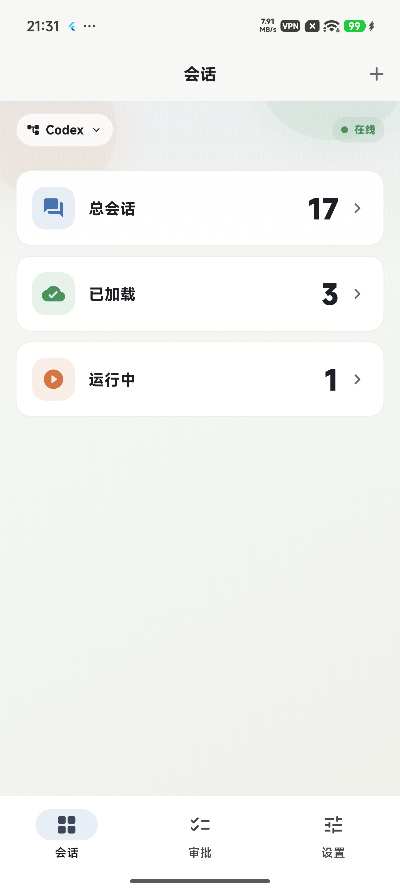
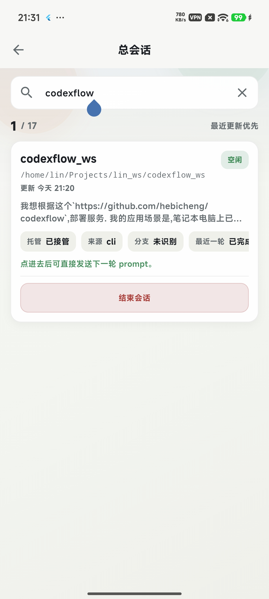
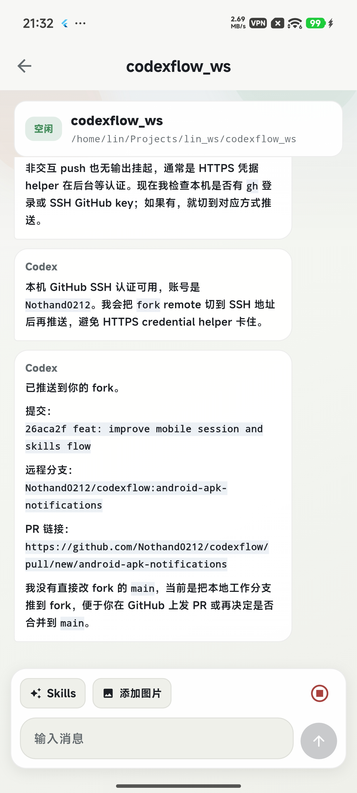
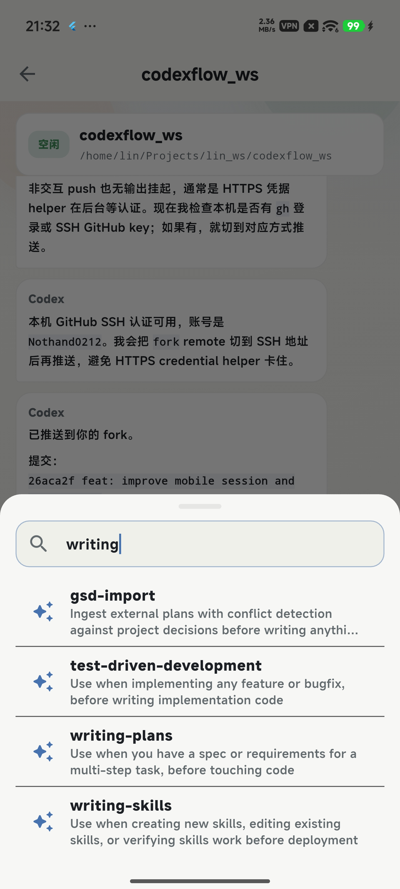

# CodexFlow

CodexFlow 是一个面向 Codex CLI 的控制台客户端。

它的目标不是“远程看终端”，而是把 Codex 的会话、turn、diff、审批、状态流，整理成一套适合手机和轻量客户端管理的控制平面。

当前已经支持两条主要 Agent 链路：

- `Codex`
- `Claude Code`

当前仓库包含三部分：

- `Go Agent`：运行在本地电脑上的服务，负责接入 Codex CLI
- `iOS App`：运行在 iPhone 上的 SwiftUI 客户端，负责监控、审批和继续指挥
- `Flutter App`：新的跨平台客户端，负责 Android / Web / 桌面端接入同一套 Agent API

## 工作原理

CodexFlow 不依赖 OCR，也不是去截图识别终端。

它直接接在 `codex app-server` 之上，通过结构化协议拿到真实的会话和执行状态，再转成适合移动端消费的 API。

整体链路如下：

```text
Codex CLI / codex app-server
        │
        │ JSON-RPC over stdio
        ▼
Go Agent
  - 启动并持有本地 codex app-server
  - 发现已有 session / loaded session
  - 接收通知、diff、plan、审批请求
  - 暴露 HTTP API + SSE
        │
        │ HTTP / SSE
        ▼
Client Apps
  - iOS SwiftUI App
  - Flutter App
  - 会话总览 / 会话详情 / 审批中心
  - 继续下一步 / steer / interrupt
```

这套设计的核心点是：

- `Go Agent` 负责把 Codex 的原始协议适配成稳定的应用层接口
- 客户端不直接操纵终端，而是操纵会话本身
- “自动发现已有会话”和“受控管理新会话”可以同时存在
- 对 `Claude Code` 会额外区分 `历史导入` 和 `可接管 runtime`

## 当前已实现的功能

### Go Agent

- 直接启动并连接本机 `codex app-server`
- 自动发现真实的 Codex 历史会话
- 自动发现 Claude 历史 transcript 与本机 live runtime
- 读取 `thread/list`、`thread/read`、`thread/loaded/list`
- 支持新建受控会话
- 支持重新接管历史会话
- 支持开始新 turn、steer 当前 turn、interrupt 当前 turn
- 支持结束会话、归档会话
- 捕获命令审批、文件变更审批、权限审批、结构化用户输入请求
- 持久化聊天图片附件，并在会话详情中返回可直接渲染的媒体 URL
- 对外提供 HTTP API 和 SSE 事件流

### iOS App

- 会话总览页
- 已接管 / 已结束 / 可接管 Runtime / 历史导入分组
- 总会话、已加载、运行中、待审批统计
- 会话详情页
- plan / diff / timeline 展示
- 继续下一步、steer、interrupt
- 审批中心
- Agent 地址配置
- 只显示真实数据，不再回退 mock 数据

### Flutter App

- 复用同一套 Agent HTTP API
- Android 优先的会话总览页：只保留 `总会话 / 已加载 / 运行中` 三个入口
- 二级会话浏览页：按最后更新时间排序，展示完整工作目录，并支持关键词搜索
- 聊天式会话详情页：使用类似微信 / WhatsApp 的气泡流，默认定位到最新消息
- 审批中心
- 设置页 / Agent 地址配置
- 图片上传与 Skills 插入放在同一条输入工具栏
- 用户和 Agent 发出的图片会作为聊天消息的一部分持久显示，支持缩略图和预览
- 启动和刷新时读取本机 Codex CLI 可用的 agent skills，并支持按名称搜索
- Claude 会话显示 `History / Runtime` 与 `现有 Runtime / 历史新开 / 新建 Runtime` 状态
- Android 前台常驻通知显示标题、状态细节、刷新/审批等图标动作
- Android / Web / 桌面端 runner 已补齐
- 已适配浏览器跨域访问本地 Agent

## 当前支持的端

- `Go Agent`：Windows、Linux、macOS (go原生支持多端)
- `客户端支持平台`：Windows、Linux、macOS、iOS、Android、Web
- `iOS SwiftUI App`：iOS
- `Flutter App`：Windows、Linux、macOS、iOS、Android、Web

## 当前已验证可用的端

- `Go Agent`（Linux / macOS）
- `iOS SwiftUI App`
- `Flutter Web (Chrome)`
- `Flutter Android`（Android 真机 / 模拟器）

## 发布产物

- Android 安装包已经发布在 GitHub Releases
- Web 构建产物也已经发布在 GitHub Releases
- 如果你只是想直接试用，可以优先从 GitHub Releases 下载对应版本
- 本地开发时，也可以把 release APK 放到 Flutter Web 静态目录里，通过同一个局域网或 Tailscale 地址下载，例如 `http://<agent-host>:8088/codexflow-android-latest.apk`

## 当前状态

项目已经能跑通真实链路：

- Agent 可以连上本机 Codex CLI
- `dashboard` API 能返回真实会话数据
- Claude 会话生命周期已经拆分为 `managed / runtime_available / history_only / ended`
- iOS 客户端可以消费真实数据并进行操作
- Flutter Web 客户端可以通过浏览器访问本地 Agent
- Flutter Android 客户端可以通过局域网或 Tailscale 访问电脑端 Agent

最近这次更新主要包括：

- Android 首页改为轻量入口页，只显示 `总会话 / 已加载 / 运行中`，点击后进入二级会话列表
- 会话列表按最后更新时间排序，保留完整工作目录路径，并支持搜索会话名、路径、分支、来源和预览文本
- 聊天窗口改为移动 IM 风格：用户和 Agent 使用左右气泡，默认只展示最终回复，隐藏推理和执行细节
- 聊天记录改为按需加载旧消息，进入会话默认滚动到最新内容，降低长历史会话的卡顿
- Skills 面板改为动态读取 Codex CLI 本机 skills，按字母排序，并在面板顶部提供搜索框
- 图片上传和 Skills 入口合并到同一条输入工具栏，适合单手操作；图片发送后会写入会话媒体存储，重新打开历史也能看到
- Android 前台常驻通知显示更多 Agent 状态信息，并提供图标化动作，便于确认后台监控是否仍在工作

当前还没有做的部分：

- 远程 relay
- 登录与设备配对
- APNs 推送
- macOS 菜单栏 Launcher
- 更细粒度的自动审批策略引擎
- 完整的 SSE 实时刷新体验

## 快速开始

### 1. 环境要求

- Windows / Linux / macOS（运行 Agent）
- 已安装并可用的 `codex` CLI
- 已完成 Codex 登录
- Go 1.26+
- Xcode（仅在运行 iOS App 时需要）
- Flutter（仅在运行 Flutter App 时需要）

### 2. 启动 Go Agent

在仓库根目录执行：

```bash
go run ./cmd/codexflow-agent
```

默认监听地址：

```text
127.0.0.1:4318
```

可选环境变量：

- `CODEXFLOW_LISTEN_ADDR`
- `CODEXFLOW_CODEX_PATH`
- `CODEXFLOW_CODEX_AUTO_APPROVE`
- `CODEXFLOW_REFRESH_INTERVAL`
- `CODEXFLOW_STATE_DB_PATH`
- `CODEXFLOW_MEDIA_DIR`

默认状态数据库路径是 `~/.codexflow/state.db`，聊天图片媒体默认存储在 `~/.codexflow/media`。如果你希望把图片附件放到单独磁盘或备份目录，可以设置：

```bash
CODEXFLOW_MEDIA_DIR=/path/to/codexflow-media go run ./cmd/codexflow-agent
```

如果你的 `codex` 不在系统 `PATH` 里，可以显式指定它：

```bash
CODEXFLOW_CODEX_PATH=/path/to/codex go run ./cmd/codexflow-agent
```

例如：

- macOS / Linux：`CODEXFLOW_CODEX_PATH=/usr/local/bin/codex`
- Windows：`CODEXFLOW_CODEX_PATH=C:\path\to\codex.exe`

如果你想先编译再运行：

```bash
go build -o codexflow-agent ./cmd/codexflow-agent
./codexflow-agent
```

在 Windows 上可执行文件会是：

```text
codexflow-agent.exe
```

### 3. Agent 多端使用方式

推荐的部署方式是：

1. 在安装了 `codex` CLI 的那台主机上运行 `Go Agent`
2. 让 Agent 暴露一个本机或局域网可访问的 HTTP 地址
3. 用 iOS / Android / Web / 桌面客户端去连接这个地址

同机使用：

```text
Agent: 127.0.0.1:4318
Client: http://127.0.0.1:4318
```

跨设备使用：

```bash
CODEXFLOW_LISTEN_ADDR=0.0.0.0:4318 go run ./cmd/codexflow-agent
```

然后在客户端里填写运行 Agent 那台机器的局域网 IP，例如：

```text
http://192.168.1.10:4318
```

#### 通过 Tailscale Service 远程访问（可选）

如果你希望在局域网外用 Android / iOS / Web 客户端访问 CodexFlow，可以把 Agent 和 Web 客户端只绑定到本机回环地址，再通过 Tailscale Service 暴露一个 tailnet 内部 HTTPS 入口。这样不需要把 CodexFlow 直接暴露到公网，也不需要在手机上记端口。

示例拓扑：

```text
https://codexflow.<tailnet>.ts.net/
  /healthz -> http://127.0.0.1:4318/healthz
  /api     -> http://127.0.0.1:4318/api
  /        -> http://127.0.0.1:8088
```

先启动 Agent：

```bash
CODEXFLOW_LISTEN_ADDR=127.0.0.1:4318 go run ./cmd/codexflow-agent
```

再启动一个静态文件服务承载 Flutter Web 构建产物，例如：

```bash
cd flutter/codexflow/build/web
python3 -m http.server 8088 --bind 127.0.0.1
```

然后配置 Tailscale Service。下面假设 service 名称是 `svc:codexflow`：

```bash
tailscale serve --service svc:codexflow --bg --https 443 http://127.0.0.1:8088
tailscale serve --service svc:codexflow --bg --https 443 --set-path /api http://127.0.0.1:4318/api
tailscale serve --service svc:codexflow --bg --https 443 --set-path /healthz http://127.0.0.1:4318/healthz
```

如果 Tailscale 提示需要管理员批准，需要先在 Tailscale 控制台批准这台机器作为 `svc:codexflow` 的 service proxy。批准后，在客户端里填写：

```text
https://codexflow.<tailnet>.ts.net
```

安全提醒：当前 CodexFlow Agent 还没有内置登录和设备配对机制。远程访问时建议只使用 tailnet 内部的 Tailscale Service，并配合 Tailscale ACL 限制可访问设备；不要用 Funnel 或公网反向代理直接公开 CodexFlow。

### 4. 验证 Agent 是否正常

```bash
curl http://127.0.0.1:4318/healthz
curl http://127.0.0.1:4318/api/v1/dashboard
```

如果正常，你会拿到健康检查结果和真实会话列表。

### 5. 运行 iOS App

用 Xcode 打开：

```text
ios/CodexFlow/CodexFlow.xcodeproj
```

然后运行 `CodexFlow` target。

### 6. 运行 Flutter App

Flutter 项目目录：

```text
flutter/codexflow
```

在该目录执行：

```bash
cd flutter/codexflow
flutter pub get
flutter run
```

如果要指定设备，例如：

```bash
flutter run -d chrome
flutter run -d emulator-5554
```

### 7. 运行 Web 版本

先构建 Web（已上传到release，可以直接下载使用）：

```bash
cd flutter/codexflow
flutter build web --release
```

构建产物目录：

```text
flutter/codexflow/build/web
```

本地运行最推荐直接用 Python：

```bash
cd flutter/codexflow/build/web
python3 -m http.server 8080
```

然后浏览器打开：

```text
http://127.0.0.1:8080
```

如果你同时想把 Android APK 放到同一个静态目录下载，可以复制 release 包到 Web 目录：

```bash
cp flutter/codexflow/build/app/outputs/flutter-apk/app-release.apk \
  flutter/codexflow/build/web/codexflow-android-latest.apk
```

然后用手机浏览器打开：

```text
http://<agent-host>:8080/codexflow-android-latest.apk
```

其中 `<agent-host>` 可以是局域网 IP，也可以是 Tailscale 分配的 `100.x.y.z` 地址。

其他方式也可以，例如：

- `npx serve build/web`
- `busybox httpd`
- `Nginx / Caddy / Apache`
- 任意静态站点托管服务

### 8. 在 App 里配置 Agent 地址

如果是同一台 Mac 上跑模拟器：

```text
http://127.0.0.1:4318
```

如果是 `iPhone 真机`、`Android 模拟器`、`Android 真机`，或者你要给其他设备访问，建议让 Agent 监听局域网：

```bash
CODEXFLOW_LISTEN_ADDR=0.0.0.0:4318 go run ./cmd/codexflow-agent
```

然后在 App 的 `Settings` 页面填入你 Mac 的局域网 IP，例如：

```text
http://192.168.1.10:4318
```

补充说明：

- `Flutter Web / Chrome`：如果页面和 Agent 在同一台 Mac 上，通常可直接使用 `http://127.0.0.1:4318`
- `Android 模拟器 / 真机`：不要填 `127.0.0.1`，要填你 Mac 的局域网 IP
- 当前 Agent 已加入浏览器跨域支持，Flutter Web 可以直接访问本地 Agent
- 如果 Android release APK 报 `ClientException with SocketException: Failed host lookup`，请确认 `android/app/src/main/AndroidManifest.xml` 声明了 `android.permission.INTERNET`。Debug/Profile manifest 中的权限不会自动覆盖 release 包。

## 基本使用方式

1. 打开 Android App 首页，选择 `总会话`、`已加载` 或 `运行中`。
2. 在二级会话列表里通过关键词搜索目标会话；列表默认按最后更新时间倒序排列。
3. 对历史会话点击“接管到 CodexFlow”，将其转为受控会话。
4. 在聊天页用气泡流查看上下文；默认只展示最终回复，推理和执行细节不会占据聊天窗口。
5. 在输入栏发送下一轮 prompt，或在当前 turn 运行中时继续 steer。
6. 点击 `Skills` 搜索并插入本机 Codex CLI 可用的 agent skill；也可以在同一栏添加图片。图片会进入聊天记录，重新加载会话时仍会显示。
7. 打开 `Approvals` 页面，处理等待中的审批请求；对不再需要的会话可以结束或归档。

补充说明：

- `Codex` 会话可以直接按 `已接管 / 已结束 / 历史会话` 理解。
- `Claude Code` 会话会进一步区分：
  - `可接管 Runtime`：当前本机还能接入 live runtime
  - `历史导入`：当前只发现 transcript，可查看历史
  - `已接管`：已经由 CodexFlow 托管

## API 概览

- `GET /healthz`
- `GET /api/v1/dashboard`
- `GET /api/v1/sessions`
- `POST /api/v1/sessions`
- `GET /api/v1/sessions/:id`
- `POST /api/v1/sessions/:id/resume`
- `POST /api/v1/sessions/:id/end`
- `POST /api/v1/sessions/:id/archive`
- `POST /api/v1/sessions/:id/turns/start`
- `POST /api/v1/sessions/:id/turns/steer`
- `POST /api/v1/sessions/:id/turns/interrupt`
- `GET /api/v1/sessions/:id/media/:mediaId`
- `POST /api/v1/uploads/image`
- `GET /api/v1/skills`
- `GET /api/v1/approvals`
- `POST /api/v1/approvals/:id/resolve`
- `GET /api/v1/events`

## 仓库结构

```text
cmd/codexflow-agent        Go Agent 启动入口
internal/codex            Codex app-server 协议适配
internal/runtime          会话管理、统计、审批编排
internal/httpapi          HTTP API 与 SSE
internal/store            本地状态存储
ios/CodexFlow             iOS SwiftUI 客户端
flutter/codexflow         Flutter 跨平台客户端
docs                      架构与路线文档
imgs                      README Android 截图资源
```

## 截图

### Android

<table>
  <tr>
    <td align="center"><br><sub>首页入口：总会话 / 已加载 / 运行中</sub></td>
    <td align="center"><br><sub>二级会话列表：按更新时间排序并支持搜索</sub></td>
  </tr>
  <tr>
    <td align="center"><br><sub>聊天页：气泡式消息流，默认展示最终回复</sub></td>
    <td align="center"><br><sub>Skills 面板：动态读取、字母排序、顶部搜索</sub></td>
  </tr>
</table>

## 说明

下一阶段计划：

- SSE 实时刷新
- macOS Launcher
- 局域网外的安全 relay
- 推送通知
- 更细粒度的自动审批策略
